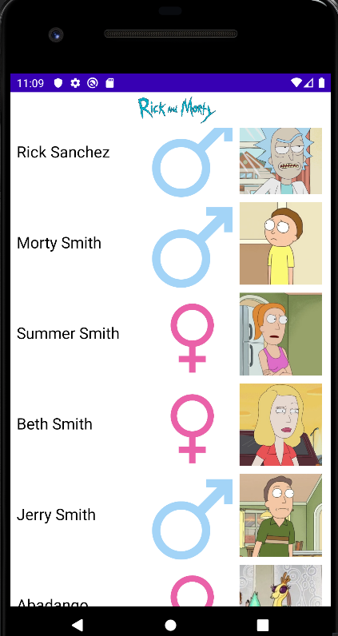
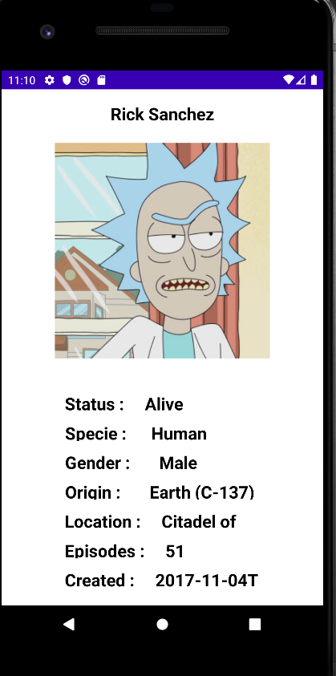

<h1> RICK AND MORTY API KULLANILARAK KARAKTERLERİN LİSTELENMESİ </h1>

<h2> Kullanılan Teknolojiler </h2>

<ol>
  <li> Retrofit </li>
  <li> Viewmodel lifecycle </li>
  <li> LiveData lifecycle </li>
  <li> Glide </li>
</ol>

<h2> Api de bulunan karakterlerin ilk 20 tanesinin anasayfada listelenmesi </h2>

<h2> Karakterlerin detay sayfası </h2>

